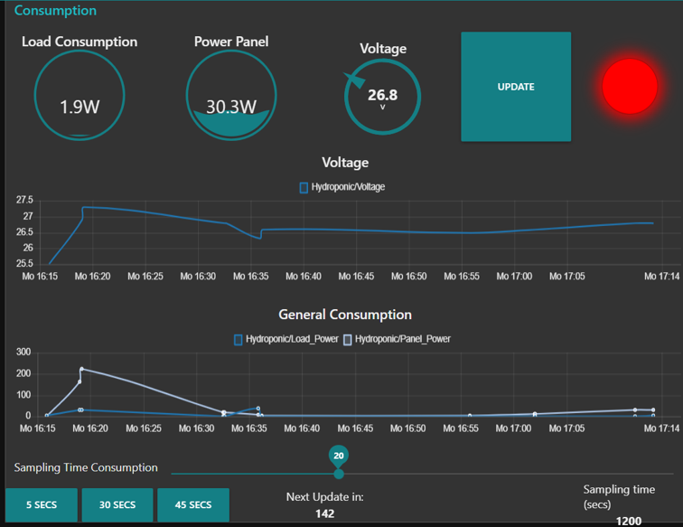

 

  
  <h3 align="center">Development of a vertical hydroponic automated and remote crop</h3>

  

     
    <a href="David_Redondo_TFG.pdf"><strong>Explore the docs »</strong></a>
     
     
  

<!-- TABLE OF CONTENTS -->

  
Table of Contents

  <ol>
    <li>
      <a href="#about-the-project">About The Project</a>
      <ul>
        <li><a href="#project-context-and-motivation">Project Context and Motivation</a></li>
        <li><a href="#objectives-of-the-project">Objectives of the Project</a></li>
        <li><a href="#software-architecture">Software Architecture</a></li>
      </ul>
    </li>
    <li><a href="#results">Usage</a></li>
    <li><a href="#license">License</a></li>
  </ol>

<!-- ABOUT THE PROJECT -->
## About The Project

In this study, a functional prototype of an automated hydroponic garden capable of working outdoors is developed and built. 
In addition, a control dashboard has been designed and coded that allows the user to monitor and control the garden remotely, and to be notified by alarms about the need of a physical intervention.
The prototype is equipped with energy autonomy through solar panels and batteries.
Likewise, it is built with reusable materials to the maximum extent possible and  optimization of the materials acquired.

### Project Context and Motivation

With each passing year, food and water shortages become more apparent. According to the Food and Agriculture Organisation of the United Nations (FAO), hunger, food shortages and malnutrition affect every country in the world. Moreover, the world wastes 17% of its food, while 811 million people suffer from hunger. Not only that, but it is estimated that the world's population will reach 9.7 billion people by 2050, which will mean a 70% increase in demand for food. 

Faced with this alarming projection, action is urgently needed to ensure food security in the future. To provide solutions to this problem, an automated hydroponic garden has been devised. fully automated, solar-powered, with a high level of productivity and designed to work both outdoors and indoors. and designed to work both outdoors and indoors. This project not only aims to address food challenges, but also to contribute to the Sustainable Development Goals (SDGs) of the 2030 Agenda.

The prototype approach is in line with SDG 11 and SDG 2: Sustainable cities and communities and world hunger zero. sustainable cities and communities and world hunger 0.

The automation and energy self-sufficiency of the prototype allows food to be produced locally, thus reducing dependence on long and costly journeys. 
food locally, thus reducing dependence on long and costly journeys. 
travel. In addition, our commitment to sustainability is reflected in the use of reusable materials and the use of reusable materials and the optimisation of purchased resources. 

Studies Studies by experts in sustainable agriculture show that hydroponic systems can hydroponic systems can significantly increase crop productivity compared to traditional cultivation methods. significantly increase crop productivity compared to traditional cultivation methods (López Elías, 2018).

On the other hand, the large-scale implementation of the developed system is highly The large-scale implementation of the developed system is highly promising, as the design based on independent modules facilitates its scalability, in addition to the benefits it offers, such as efficiency in the use of water and resources. 

This defines it as an energetically sustainable and environmentally friendly agricultural system. environmentally friendly.
In short, our automated hydroponic garden project is more than just a solution to cope with the lack of water and resources. simply a solution to cope with the lack of food.

### Objectives of the Project

This project aims to develop a scalable prototype that allows:
- Generate a high production of plants in a reduced space.
- Power the production and control systems autonomously by means of solar energy. 
- To be controlled remotely and without distance restrictions.
- Monitor and control the parameters necessary for plant growth. 
growth.
- Show resistance to adverse weather conditions and functionality in outdoor environments.
- Demonstrate the ability to successfully grow plants without the need for soil, using hydroponics as a growing technique. growing technique.

### Software Architecture

*Figure 1: Architecture of remote communications.*

*Figure 2: Jerarchy of control and its communication protocols.*

## Node-Red

## Power supply

*Figure 3: Scheme of power supply system*

### Results

*Figure 4: Project finished*

*Figure 5: Results.*

<!-- LICENSE -->
## License

Distributed under the BSD 3-Clause License. See `LICENSE.txt` for more information.

(<a href="#readme-top">back to top</a>)

